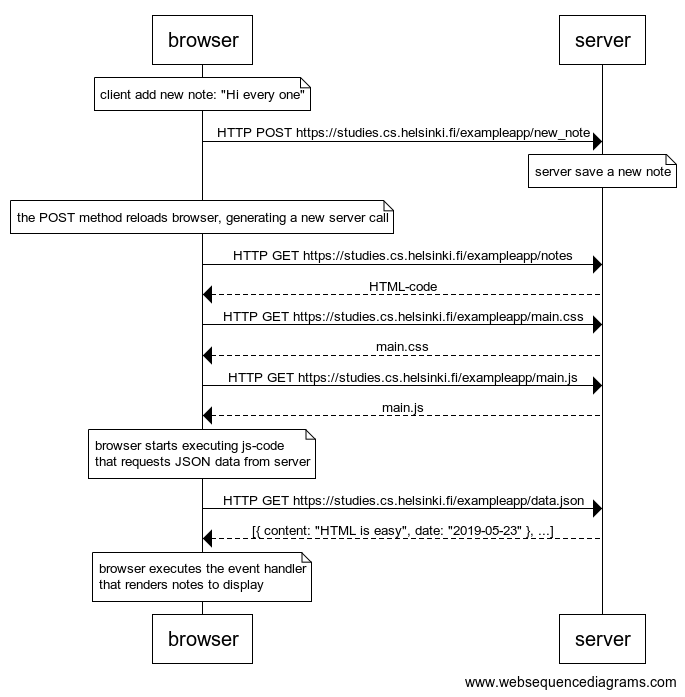
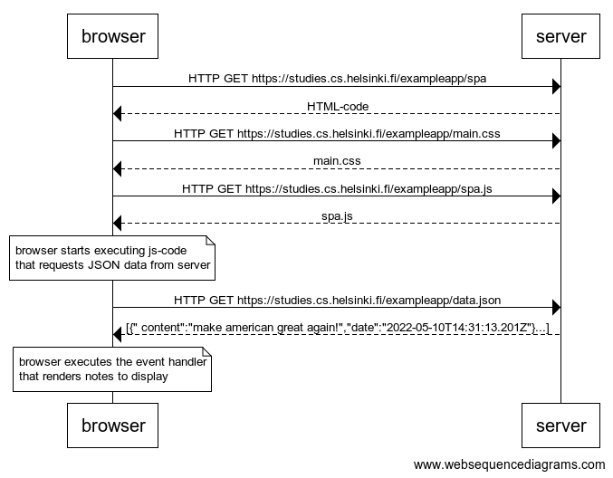

# **Full Stack Open 2025**

Este repositorio está hecho para agregar las soluciones a los diferentes retos impuestos por el Bootcamp Full Stack Open 2025

## **Contenido**

- [**Full Stack Open 2025**](#full-stack-open-2025)
  - [**Part 0: Fundamentos de las aplicaciones web**](#part-0-fundamentos-de-las-aplicaciones-web)
    - [0.4: Nueva nota](#04-nueva-nota)
    - [0.5: Aplicación de una sola página](#05-aplicación-de-una-sola-página)
    - [0.6: Nueva nota spa](#06-nueva-nota-spa)
  - [**Estado del curso**](#estado-del-curso)
  - [**Tecnologías utilizadas**](#tecnologías-utilizadas)
  - [**Estado del curso**](#estado-del-curso)
  - [**Licencia**](#licencia)
  - [**Contacto**](#contacto)

## **Part 0: Fundamentos de las aplicaciones web**

### 0.4: Nueva nota

Crear un diagrama similar que describa la situación en la que el usuario crea una nueva nota en la página [https://studies.cs.helsinki.fi/exampleapp/notes](https://studies.cs.helsinki.fi/exampleapp/notes) escribiendo algo en el campo de texto y haciendo clic en el botón submit.

- usuario rellena el input y se enviá la información mediante un botón llamado "save".
- el navegador envía una solicitud post con la información del formulario a la dirección "exampleapp/new_note".
- el servidor guarda la información recibida.
- el evento submit recarga el navegador realizando una nueva petición al servidor, cargado los archivos notes, main.css y main.js.

```json
note over browser:
client add new note: "Hi every one"
end note
browser->server: HTTP POST https://studies.cs.helsinki.fi/exampleapp/new_note

note over server:
server save a new note
end note

note over browser:
the POST method reloads browser, generating a new server call
end note

browser->server: HTTP GET https://studies.cs.helsinki.fi/exampleapp/notes
server-->browser: HTML-code
browser->server: HTTP GET https://studies.cs.helsinki.fi/exampleapp/main.css
server-->browser: main.css
browser->server: HTTP GET https://studies.cs.helsinki.fi/exampleapp/main.js
server-->browser: main.js

note over browser:
browser starts executing js-code
that requests JSON data from server
end note

browser->server: HTTP GET https://studies.cs.helsinki.fi/exampleapp/data.json
server-->browser: [{ content: "HTML is easy", date: "2019-05-23" }, ...]

note over browser:
browser executes the event handler
that renders notes to display
end note
```



#### 0.5: Aplicación de una sola página

Cree un diagrama que describa la situación en la que el usuario accede a la versión de aplicación de una sola página de la aplicación de notas en [https://studies.cs.helsinki.fi/exampleapp/spa](https://studies.cs.helsinki.fi/exampleapp/spa).

- al realizar una petición el navegador carga el archivo spa y quien tiene la estructura html.
- dentro de la estructura html se encuentra la petición main.css y spa.js.
- dentro del código de spa.js se encuentra una petición a "https://studies.cs.helsinki.fi/exampleapp/data.json", retornando el archivo data.json
- el navegador renderiza los datos en el html.

```json
browser->server: HTTP GET https://studies.cs.helsinki.fi/exampleapp/spa
server-->browser: HTML-code
browser->server: HTTP GET https://studies.cs.helsinki.fi/exampleapp/main.css
server-->browser: main.css
browser->server: HTTP GET https://studies.cs.helsinki.fi/exampleapp/spa.js
server-->browser: spa.js

note over browser:
browser starts executing js-code
that requests JSON data from server
end note

browser->server: HTTP GET https://studies.cs.helsinki.fi/exampleapp/data.json
server-->browser: [{" content":"make american great again!","date":"2025-05-10T14:31:13.201Z"}...]

note over browser:
browser executes the event handler
that renders notes to display
end note
```



#### 0.6: Nueva nota spa

Cree un diagrama que represente la situación en la que el usuario crea una nueva nota utilizando la versión de una sola página de la aplicación.

- usuario rellena el input y se enviá la información mediante un botón llamado "save".
- el navegador renderiza la nueva nota sin recargarse, esta es una propiedad que tiene las spa.
- el navegador enviá una solicitud post con la información del formulario a la dirección "exampleapp/new_note_spa".
- el servidor guarda la información recibida.
- el servidor retorna un mensaje de repuesta "note created".

```json
note over browser:
spa.js add a new note in notes array, then added to the <ul> node
end note

browser->server: HTTP POST https://studies.cs.helsinki.fi/exampleapp/spa
server-->browser: {"message":"note created"}
```

## **Tecnologías utilizadas**

- **Frontend:** React, JavaScript, HTML, CSS
- **Backend:** Node.js, Express
- **Base de datos:**
- **Herramientas:** Git

## **Estado del curso**

| Parte | Estado |
| ----- | ------ |
| 0     | ☑️     |
| 1     | ☑️     |
| 2     | ⬛     |
| 3     | ⬛     |
| 4     | ⬛     |
| 5     | ⬛     |
| 6     | ⬛     |
| 7     | ⬛     |
| 8     | ⬛     |
| 9     | ⬛     |

## **Licencia**

Este proyecto está licenciado bajo los términos de la [Licencia MIT](LICENSE).

Puedes usar, modificar y distribuir este código libremente, siempre y cuando conserves el aviso de copyright y la licencia original.

## **Contacto**

- Website [mooenz.me](https://www.mooenz.me/)
- GitHub [@mooenz](https://github.com/Mooenz)
- Twitter [@mooenzdev](https://twitter.com/MooenzDev)
